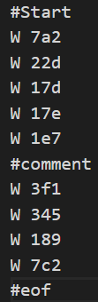
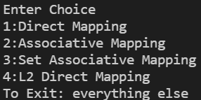
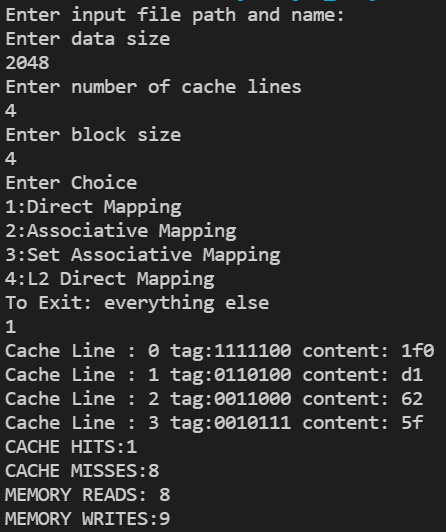
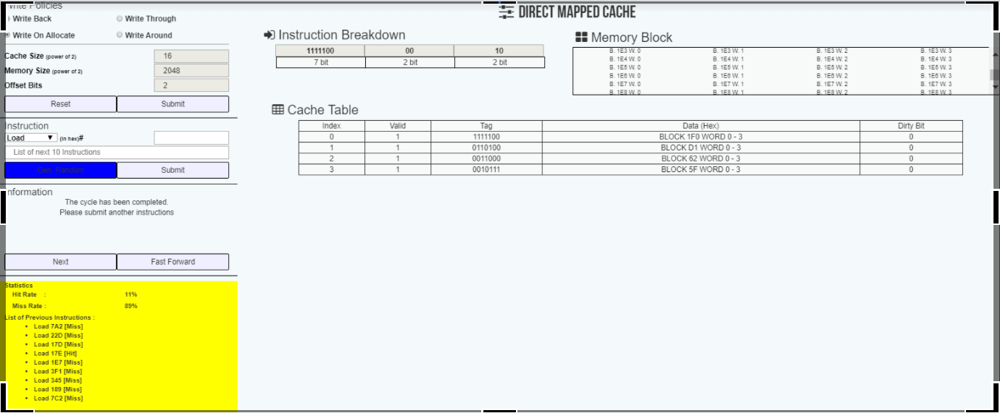
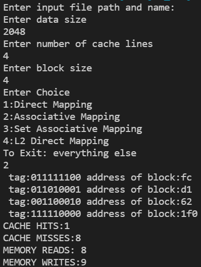
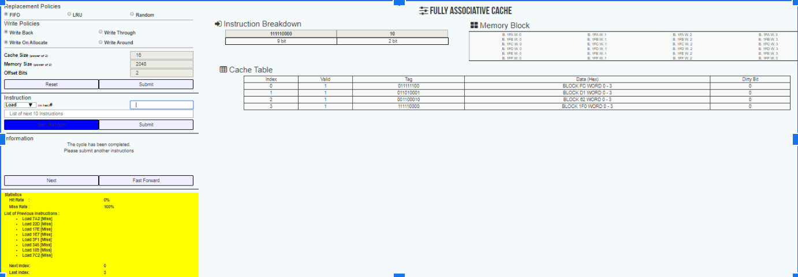
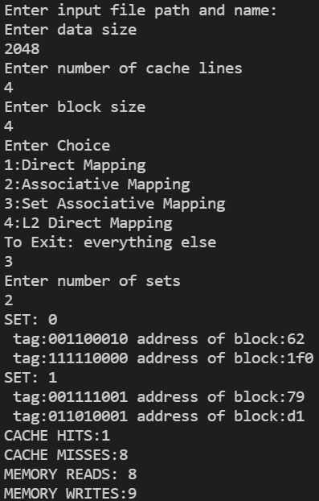
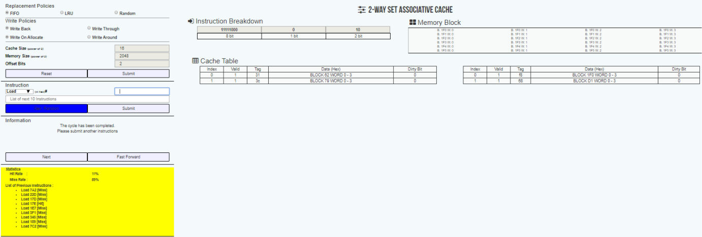

## Cache Simulator

Saurav Rao

1. **Introduction**
The program is a cache simulator with user provided cache configuration. It has options for different mappings (Direct, Associative,Set Associative).
The program also has an option for 2Level Direct Mapping cache.
The program is coded in java and written as part of [cache assignment](assets/CacheProject.pdf)

2. **Input**
* The program takes an address( of a .txt file) and stores it in String `inFile`.
The address should be relative eg. `cachesimulaotr\\src\\input.txt`
The .txt file contains variable number of lines. Each line can either be comment (`if it starts with #`) or a line from CPU which has `OPCODE` and hexadecimal address requested by CPU separated by a space.
`OPCODE` is either `W` (for writing in cache) or `R` (for reading from cache)
 ##### input.txt files look like as shown in image

*  `Enter data size` takes integer (which is some positive integer power of 2) as an input and stores it in int s.
*  `Enter number of cache lines` takes integer (which is some positive integer power of 2) as an input and stores it in int cl.
*  `Enter block size` takes integer (which is some positive integer power of 2) as an input and stores it in int b.
*  `Enter Choice` takes integer as an input and maps cache as shown below

*  If user selects option 3 then further input is required for number of sets

3. **Output**

Input file is as shown below for all the following cases

Output from my program for direct mapping is

Output as per online cache simulation website [https://www.ntu.edu.sg/home/smitha/ParaCache/Paracache/dmc.html](https://www.ntu.edu.sg/home/smitha/ParaCache/Paracache/dmc.html)

Output from my program for associative mapping is

Output as per online cache simulation website [https://www.ntu.edu.sg/home/smitha/ParaCache/Paracache/dmc.html](https://www.ntu.edu.sg/home/smitha/ParaCache/Paracache/dmc.html)

Output from my program for set associative mapping is

Output as per online cache simulation website [https://www.ntu.edu.sg/home/smitha/ParaCache/Paracache/dmc.html](https://www.ntu.edu.sg/home/smitha/ParaCache/Paracache/dmc.html)

Output for L2 cache is

Oops!! The <a href="https://www.ntu.edu.sg/home/smitha/ParaCache/Paracache/dmc.html
">website</a> doesn&#39;t support multilevel cache simulation so I could not get Output :(

4. **Implementation**

Functions used are:-

*  `private static void displayCacheML(CacheL2 cacheML)`
To display multilevel cache set wise.
It takes object of class CacheL2 as parameter

* `private static void writeL1(CacheL2 cacheML,String st)`
To write in level1 cache of multi-level cache
It takes object of class CacheL2 , line from CPU of type String as inputs

* `private static void writeL2(CacheL2 cacheML, String st)`
To write in level1 cache of multi-level cache
It takes object of class CacheL2 , line from CPU of type String as inputs

* `private static void readML(CacheL2 cacheML, String st)`
To read Multi Level cache
It takes object of class CacheL2 , line from CPU of type String as inputs

* `private static CacheL2 createCacheL2(int cl, int b)`
To initialize an object of class CacheMl
It takes integer cl(number of cache lines in one level), integer b (block size)

* `private static void displayCacheSAM(CacheSAM cacheSAM)`
To display Set Associative mapped cache
It takes object of class CacheSAM as input

* `private static  void writeSAM(CacheSAM cacheSAM, String st)`
To write on set associative mapped cache
It takes object of class CacheSAM , line from CPU (string) as inputs

* `private static void readSAM(CacheSAM cacheSAM, String string)`
To read from Set Associative Mapped cache
It takes object of class CacheSAM , line from CPU(String) as input

* `private static void displayCacheAM(CacheAM cache)`
To display Associative Mapped Cache
It takes object of class CacheAM

* `private static void writeAM(CacheAM cacheAM, String st, int cl)`
To write in Associative Mapped Cache
It takes object of class CacheAM,line from CPU (String) and integer number of cache lines as input

* `private static void readAM(CacheAM cacheAM, String st, int cl)`
To read from Associative Mapped Cache
It takes object of class CacheAM,line from CPU (String) and integer number of cache lines as input

* `private static void displayCache(Cache cache)`
To display Direct Mapped Cache
It takes object of class Cache as parameter

* `private static void write(Cache cache, String st)`
To write in Direct Mapped cache
It takes object of class Cache, line from CPU(String)as parameters

* `private static void read(Cache cache, String st)`
To read direct mapped cache
It takes object of class Cache, line from CPU(String) as parameters

* `static int whatPower(int a)`
To calculate what power of 2 is a
It takes an integer which is some positive power of 2 as parameter
It return integer x (2\*\*x)=a

* `private static Cache createCache(int cl, int b)`
To initialize direct mapped cache

* `private static CacheAM createCacheAM(int cl,int b)`
To initialize Associative Mapping cache
* `private static CacheSAM createCacheSAM(int cl, int b,int sets)`
To initialize SAM cache
* `static String htob(String str, int x)`
Hexadecimal to binary string of length x
Returns a String

* `static String btoh(String str)`
Binary to hexadecimal
Returns a String

#### Classes used are:-

1. **class** Block
2. **class** Cache
3. **class** CacheAM
4. **class** CacheSAM
5. **class** CacheL2